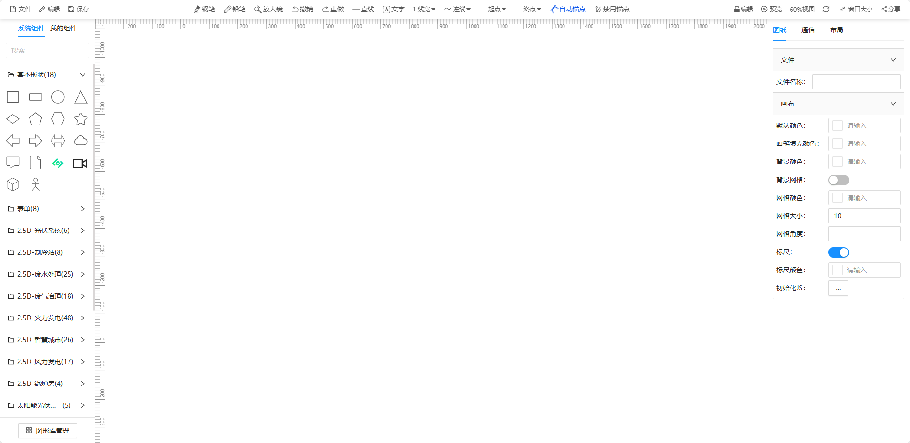
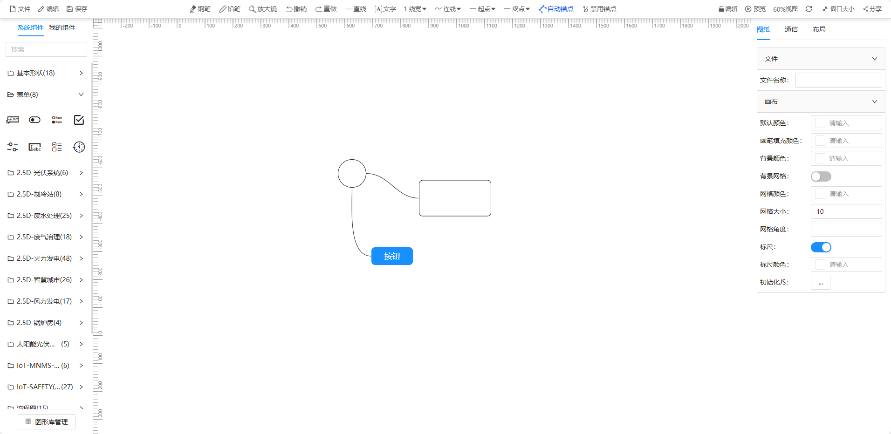
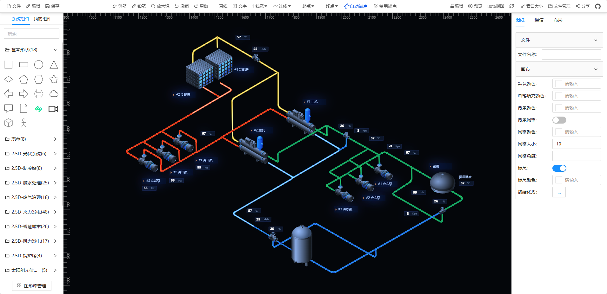

<!--
 * @Descripttion:
 * @version: 1.0.0
 * @Author: htang
 * @Date: 2024-04-01 16:26:12
 * @LastEditors: htang
 * @LastEditTime: 2024-10-09 15:00:56
-->

基于meta2d.js开发的编辑器
===============
当前最新版本：0.0.2（发布时间：2024-04-03）

[](https://github.com/opendidi/mind/blob/main/LICENSE)
[](https://github.com/opendidi/mind)

## 源码下载或者预览

- 前端源码 ：https://github.com/opendidi/mind
- 在线预览 ：https://opendidi.github.io/mind

## 基于meta2d.js开源开发

- 开源地址：https://github.com/le5le-com/meta2d.js

## 后端服务启动

> python版本要求python3.8.10

```python
> python starter.py
```

## 安装与使用

 > 环境要求: 前端版本要求Node 14.18+ / 16+ 版本以上
 > 建议使用pnpm否则依赖可能安装不上。

- Get the project code

```bash
git clone https://github.com/opendidi/mind.git
```

- Installation dependencies

```bash
cd mind

pnpm install
```

- run

```bash
pnpm start
```


- build

```bash
pnpm build
```

项目可视化编辑页面1
> 

项目可视化编辑页面2
> 

项目可视化编辑页面3
> 