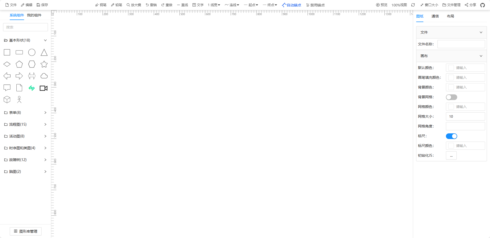

<!--
 * @Descripttion:
 * @version: 1.0.0
 * @Author: htang
 * @Date: 2024-04-01 16:26:12
 * @LastEditors: htang
 * @LastEditTime: 2025-08-15 10:03:40
-->

基于meta2d.js开发的编辑器
===============
当前最新版本：0.0.2（发布时间：2024-04-03）

[](https://github.com/opendidi/mind/blob/main/LICENSE)
[](https://github.com/opendidi/mind)

## 源码下载或者预览

- 前端源码 ：https://github.com/opendidi/mind
- 在线预览 ：https://opendidi.github.io/mind

## 基于meta2d.js开源开发

- [meta2D开源地址](https://github.com/le5le-com/meta2d.js)
- 文档地址：[2D图元组成的可视化引擎](https://doc.le5le.com/document/119359590)

## 后端服务启动

> python版本要求python3.8.10

```python
> python starter.py
```

## 安装与使用

 > 环境要求: 前端版本要求Node 14.18+ / 16+ 版本以上
 > 建议使用pnpm否则依赖可能安装不上。

- Get the project code

```bash
git clone https://github.com/opendidi/mind.git
```

- Installation dependencies

```bash
# 根目录下载依赖
pnpm install
```

- run

```bash
pnpm dev:web
```


- build

```bash
pnpm build:web
```

前端打包打包文件路径配置 [点击查看](./web/build/constant.ts)

```js
 export const OUTPUT_DIR = '../docs';
```

项目可视化编辑页面
> 