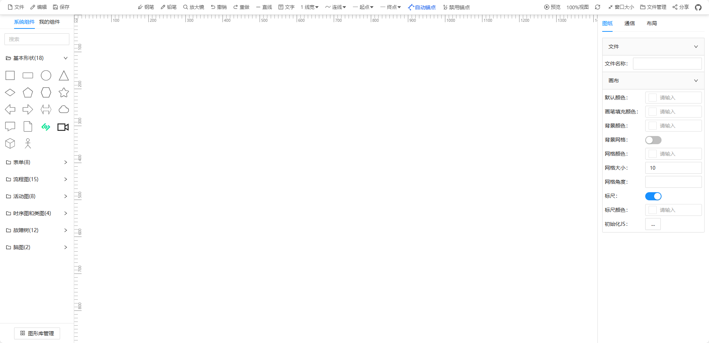

# mind — AI 驱动的图形可视化编辑器

基于 [meta2d.js](https://github.com/le5le-com/meta2d.js) 开发的 2D 图形可视化编辑器，集成 AI Agent 系统，支持通过自然语言操控画布、生成图表、管理蓝图。

**当前版本：** 0.0.2 | **在线预览：** [opendidi.github.io/mind](https://opendidi.github.io/mind)

[](https://github.com/opendidi/mind/blob/main/LICENSE)
[](https://github.com/opendidi/mind)

---



## 功能特性

### 图形编辑
- 🎨 **丰富图元** — 矩形、圆形、三角形、菱形、五边形、星形、文本、图片等基础图形
- 🔗 **智能连线** — 直线、曲线、折线、思维导图曲线，支持多方向箭头
- 📐 **自动布局** — 水平/垂直/网格排列，左/右/居中/上/下对齐
- ↩️ **撤销重做** — 完整的操作历史回退，使用 structuredClone 高性能序列化
- 🔍 **鹰眼地图** — 全局缩略图导航
- 🔒 **三种模式** — 编辑 / 预览 / 锁定
- 📏 **标尺与网格** — 辅助精确定位
- ⌨️ **键盘快捷键** — Delete 删除、Ctrl+C/V/A/D 复制粘贴全选复制、方向键微调、Escape 取消选中

### 图表类型

| 类型 | 说明 |
|------|------|
| 流程图 | 步骤→判断→分支，带箭头连线 |
| 架构图 | 组件/服务拓扑，依赖关系 |
| 思维导图 | 中心主题→分支→细节，radial 布局 |
| 类图 | UML 类结构 |
| 时序图 | 时间线交互 |
| 活动图 | 业务流程 |
| FTA 图 | 故障树分析 |
| 表单图 | UI 表单布局 |

### 文件管理
- 📁 **树形目录** — 文件夹管理，拖拽移动
- 📤 **上传下载** — 支持图片、SVG、文档
- 👁️ **在线预览** — 图片和 SVG 即时预览
- 📋 **素材库** — 可复用的图形模板

### 蓝图系统
- 💾 **保存加载** — 完整画布状态持久化到后端
- 📤 **多格式导出** — PNG（位图）/ SVG（矢量）/ JSON（数据）
- 🔍 **搜索** — 按名称和分类检索

### AI 助手
- 🤖 **自然语言操控画布** — 通过对话创建/编辑图形和连线
- 🧠 **智能图表生成** — 根据描述自动生成流程图、架构图、思维导图
- 📋 **蓝图管理** — 搜索、加载、保存、导出蓝图
- 📐 **自动排版** — AI 驱动的图形排列和对齐
- 🔧 **工具调用可视化** — 实时展示 Agent 的工具调用、思考过程和执行计划
- 💬 **双入口对话** — 全屏聊天页（`/chat`）+ 编辑器侧边栏 AgentPanel

---

## 技术栈

| 层 | 技术 |
|----|------|
| **前端** | Vue 3 + TypeScript + Vite 4 |
| **UI 库** | Ant Design Vue 3.2 + TDesign Vue Next |
| **图形引擎** | @meta2d/core + 8 个 diagram 插件 |
| **图表** | ECharts 6 |
| **思维导图** | markmap |
| **代码编辑器** | Monaco Editor |
| **地图** | AMap（高德地图） |
| **状态管理** | Pinia 2 |
| **后端** | Python 3.10+ / Flask 3.0 + eventlet |
| **数据库** | MySQL 8.0 (PyMySQL + DBUtils 连接池) |
| **对象存储** | MinIO |
| **LLM** | DeepSeek API（主）+ 多级 Fallback |
| **缓存** | Redis 7（会话、搜索缓存、Agent 记忆、LLM 确定性缓存） |
| **包管理** | pnpm (monorepo) |

---

## 项目结构

```
mind/
├── app/                                    # Python 后端
│   ├── __init__.py                         # Flask app 工厂 — CORS、安全头、速率限制、蓝图注册
│   ├── config/
│   │   ├── __init__.py                     # 环境变量配置（DB / Redis / LLM / MinIO / TTS）
│   │   └── protocol.py                     # API 协议常量和状态码
│   ├── api/v1/
│   │   ├── __init__.py                     # 注册所有蓝图（auth, material, categories, blueprint, agent, chat）
│   │   ├── agent.py                        # Agent SSE 流式对话 + MCP JSON-RPC + TTS + Health
│   │   ├── auth.py                         # 认证（登录、注册、刷新 Token）
│   │   ├── chat.py                         # 会话管理 CRUD + 反馈
│   │   ├── blueprint.py                    # 蓝图 CRUD
│   │   ├── material.py                     # 素材管理 CRUD
│   │   └── categories.py                   # 分类
│   ├── package/module/                     # MySQL 数据访问层
│   │   ├── connect.py                      # 连接管理
│   │   ├── user_mysql.py                   # 用户 CRUD
│   │   ├── chat_mysql.py                   # 会话消息 CRUD
│   │   ├── blueprint_mysql.py              # 蓝图 CRUD
│   │   ├── material_mysql.py               # 素材 CRUD
│   │   └── categories_mysql.py             # 分类 CRUD
│   ├── plugin/
│   │   ├── minio/                          # MinIO 对象存储（上传/下载/预览）
│   │   └── auth/                           # JWT 认证装饰器
│   └── util/
│       ├── llm_client.py                   # LLM 客户端 — 懒加载单例 + 多级 Fallback
│       ├── vision.py                        # 视觉分析（DeepSeek Vision）
│       ├── search/                          # 搜索引擎（Bing + DuckDuckGo fallback）
│       ├── agent/                           # Agent 系统核心包（27 子模块，六层架构）
│       │   ├── __init__.py                  # 包初始化，重导出关键类
│       │   ├── core.py                      # AgentSession — 消息构建、视觉桥接、会话管理
│       │   ├── engine.py                    # AgentEngine — 统一执行入口，模式路由
│       │   ├── guard.py                     # InputGuard / ToolGuard / OutputGuard 三级安全
│       │   ├── intent.py                    # 意图分类 + 统一意图规划（单次 LLM 调用）
│       │   ├── router.py                    # 意图 → Skill 路由
│       │   ├── planner.py                   # 任务规划器
│       │   ├── executor.py                  # BaseExecutor / AgentExecutor（工具执行 + 护栏）
│       │   ├── dag.py                       # DAGExecutor — 拓扑排序 + 并行执行
│       │   ├── dispatcher.py                # 子 Agent 调度器（canvas/blueprint/file/code）
│       │   ├── tools.py                     # 工具注册表 + 17 个业务工具
│       │   ├── memory.py                    # 长期记忆管理（跨会话）
│       │   ├── reflexion.py                 # AgentReflexion — 工具失败自纠正（retry/skip/escalate）
│       │   ├── pheromone.py                 # 信息素黑板 — 跨节点共享发现
│       │   ├── plan_eval.py                 # Plan-Feedback 闭环 — 执行后评分 → 历史教训
│       │   ├── cache.py                     # 工具结果缓存 + LLM 确定性缓存（Redis）
│       │   ├── circuit.py                   # Circuit Breaker — LLM 熔断保护
│       │   ├── fallback.py                  # FallbackLLM — 多级故障转移
│       │   ├── llm_stream.py                # SSE 流式响应处理
│       │   ├── retry.py                     # 统一重试包装器（含指数退避）
│       │   ├── tracer.py                    # Span 树调用链追踪
│       │   ├── observability.py             # HealthChecker + MetricsCollector + Token 预算
│       │   ├── adaptive.py                  # 自适应重规划
│       │   ├── helpers.py                   # JSON 修复、Token 估算、工具函数
│       │   ├── constants.py                 # 共享常量（重试次数、消息限制等）
│       │   ├── skills.py                    # Skill 注册表（渐进式提示词注入）
│       │   ├── mcp.py                       # MCP 协议封装
│       │   ├── evaluator.py                 # 输出质量评估
│       │   ├── tts.py                       # ChatTTS 文本转语音
│       │   ├── skills/                      # 域 Skill 模块
│       │   │   ├── canvas_skill.py          # 画布编辑知识
│       │   │   ├── blueprint_skill.py       # 蓝图管理知识
│       │   │   ├── mindmap_skill.py         # 思维导图知识
│       │   │   ├── file_skill.py            # 文件管理知识
│       │   │   └── code_skill.py            # 代码生成知识
│       │   ├── agents/                      # 子 Agent
│       │   │   ├── base.py                  # AgentBase（ReAct 循环基类）
│       │   │   ├── canvas_agent.py          # CanvasAgent — 画布操作
│       │   │   ├── blueprint_agent.py       # BlueprintAgent — 蓝图管理
│       │   │   ├── file_agent.py            # FileAgent — 文件素材
│       │   │   └── code_agent.py            # CodeAgent — 代码生成
│       │   └── eval/                        # Agent 评估框架
│       └── json_response.py                 # 统一 JSON 响应工具
│
├── web/                                    # Vue 3 前端
│   ├── src/
│   │   ├── main.ts                          # 应用入口 — Pinia、Router、Ant Design、TDesign、Monaco
│   │   ├── views/
│   │   │   ├── Index.vue                    # 主编辑器页面（Meta2D 画布 + 图形库 + 属性面板）
│   │   │   ├── Preview.vue                  # 只读预览模式
│   │   │   ├── chat/
│   │   │   │   └── index.vue                # 全屏 AI 对话页（含会话列表 + 聊天区）
│   │   │   └── user/                        # 登录 / 注册 / 个人中心
│   │   ├── components/
│   │   │   ├── Meta2D/                      # 核心编辑器组件（17 个子组件）
│   │   │   │   ├── Editor/                  # Meta2D 画布渲染
│   │   │   │   ├── Header/                  # 顶部工具栏（撤销/重做/缩放/保存/AI 助手）
│   │   │   │   ├── Graphics/                # 左侧图形库侧边栏
│   │   │   │   ├── Props/                   # 右侧统一属性面板
│   │   │   │   ├── PenProps/                # 单图形属性编辑（带 100ms 渲染防抖）
│   │   │   │   ├── FileProps/               # 画布级设置
│   │   │   │   ├── Appearance/              # 多选外观样式
│   │   │   │   ├── Animate/                 # 动画帧配置
│   │   │   │   ├── Event/                   # 事件/动作绑定
│   │   │   │   ├── DataValue/               # 数据变量绑定
│   │   │   │   ├── Frames/                  # 帧/动画时间线
│   │   │   │   ├── EditContainer/           # Monaco 代码编辑器容器
│   │   │   │   ├── Share/                   # 导出/分享弹窗
│   │   │   │   └── Video/                   # 视频播放器覆层
│   │   │   ├── AgentPanel/                  # AI 对话抽屉面板
│   │   │   │   ├── index.vue                # 抽屉容器 + SSE 流管理
│   │   │   │   ├── AgentInput.vue           # 消息输入框
│   │   │   │   ├── AgentMessageItem.vue     # 消息气泡渲染
│   │   │   │   ├── AgentThinkCard.vue       # 思考步骤卡片
│   │   │   │   ├── AgentToolCard.vue        # 工具调用卡片
│   │   │   │   ├── AgentToolGroupCard.vue   # 工具调用分组
│   │   │   │   └── AgentStreamHandler.ts    # SSE 事件流处理
│   │   │   ├── chat/                        # 全屏聊天组件
│   │   │   │   ├── ChatInput.vue            # 消息输入栏（文本/文件/语音/引用）
│   │   │   │   ├── ChatSidebar.vue          # 左侧会话列表（CRUD、搜索、Pin、导出）
│   │   │   │   ├── MsgRow.vue               # 消息行（支持 Markdown、代码块复制、图表卡片）
│   │   │   │   ├── MsgContextMenu.vue       # 右键菜单（复制/删除/反馈）
│   │   │   │   ├── MsgReferenceCard.vue     # 引用消息卡片
│   │   │   │   ├── ReferencePanel.vue       # 引用附件面板
│   │   │   │   ├── WelcomePanel.vue         # 空状态欢迎词
│   │   │   │   ├── ThinkCard.vue            # 思考过程卡片（可折叠）
│   │   │   │   ├── PlanCard.vue             # Agent 执行计划卡片
│   │   │   │   ├── CanvasPreview.vue        # 画布预览内联渲染
│   │   │   │   ├── ChartCard.vue            # ECharts 图表卡片
│   │   │   │   ├── FileCard.vue             # 文件信息卡片
│   │   │   │   └── MindMapCard.vue          # markmap 思维导图卡片
│   │   │   ├── FileManager/                 # 文件/素材管理器（含预览/重命名/上传子组件）
│   │   │   ├── blueprint/                   # 蓝图弹窗（缩略图列表 + 打开/删除）
│   │   │   └── shared/                      # 共享组件（MapCard, RouteCard）
│   │   ├── composables/                     # Vue Composables（10 个）
│   │   │   ├── useAgentChat.ts              # Agent SSE 流式聊天核心逻辑
│   │   │   ├── useConversations.ts          # 会话 CRUD、Pin、分页、路由同步
│   │   │   ├── useCanvas.ts                 # Meta2D 画布实例 provide/inject
│   │   │   ├── useSpeech.ts                 # TTS 语音合成（Web Speech API + ChatTTS）
│   │   │   ├── useKeyboardShortcuts.ts      # 全局键盘快捷键
│   │   │   ├── useScrollToBottom.ts         # 聊天列表自动滚底
│   │   │   ├── useAttachments.ts            # 文件附件管理
│   │   │   ├── useAuthCaptcha.ts            # 图形验证码
│   │   │   ├── useMessageSelect.ts          # 消息多选（引用）
│   │   │   └── useTheme.ts                  # 暗色/亮色主题切换
│   │   ├── api/                             # API 客户端（5 个模块）
│   │   │   ├── agent.ts                     # Agent SSE + TTS
│   │   │   ├── chat.ts                      # 会话 CRUD + 反馈 + 文件上传
│   │   │   ├── user.ts                      # 认证（登录/注册/Token 刷新/个人中心）
│   │   │   ├── blueprint.ts                 # 蓝图 CRUD
│   │   │   └── material.ts                  # 素材 CRUD
│   │   ├── store/
│   │   │   └── modules/user.ts              # Pinia 用户状态（Token、登录/退出、个人信息）
│   │   ├── router/
│   │   │   ├── index.js                      # Hash 路由（首页/预览/聊天/登录/注册/个人中心）
│   │   │   └── permission.js                # 路由守卫（Token 校验 + 重定向）
│   │   └── utils/                           # 工具函数（15 个模块）
│   │       ├── request.ts                    # Axios 实例（自动 Token 刷新、错误处理）
│   │       ├── canvasBridge.ts               # 聊天 ↔ 画布双向通信桥
│   │       ├── graphicGroups.ts              # 图形分组配置
│   │       ├── meta-storage.ts               # 画布持久化（localStorage）
│   │       ├── defaultConfig.ts              # Meta2D 默认配置
│   │       ├── config-contentmenu.ts         # 画布右键菜单配置
│   │       ├── config-line.ts                # 连线样式配置
│   │       ├── FileExplorer.ts               # 文件树数据结构
│   │       ├── sanitize.ts                   # 输入清洗
│   │       ├── uuid.ts                       # UUID 生成
│   │       └── urlParamsManager.ts           # URL 查询参数管理
│   ├── .env                                  # 前端环境变量
│   ├── .env.development                      # 开发环境
│   └── vite.config.ts                        # Vite 构建配置（代理、Monaco 分块、Windi CSS）
│
├── tests/                                   # Python 测试（11 个文件）
│   ├── conftest.py                           # 共享 Fixtures（Flask app、mock LLM/Redis/DB）
│   ├── test_agent_api.py                     # Agent SSE / TTS 端点测试
│   ├── test_agent_guard.py                   # Guard 三级安全测试
│   ├── test_agent_tools.py                   # 工具函数测试
│   ├── test_llm_retry.py                     # LLM 重试/退避测试
│   ├── test_memory_unified.py                # 统一记忆管理测试
│   ├── test_material_mysql.py                # 素材 MySQL CRUD 测试
│   ├── test_minio.py                         # MinIO 对象存储测试
│   ├── test_search_engines.py                # 搜索引擎测试
│   └── test_vision.py                        # 视觉分析测试
│
├── scripts/
│   └── run_checks.sh                         # 全量质量门禁（Ruff → Pytest → vue-tsc → Build）
├── sql/                                      # 数据库初始化脚本
├── docs/                                     # GitHub Pages 部署目录
├── static/                                   # 静态资源
├── images/                                   # 截图
├── starter.py                                # 后端启动入口
├── Dockerfile                                # Python 3.12-slim 镜像（Aliyun 源）
├── docker-compose.yml                        # 三服务编排（app + mysql + redis）
├── requirements.txt                          # Python 依赖
├── pyproject.toml                            # Ruff + Pytest 配置
├── .env.example                              # 环境配置模板
└── CLAUDE.md                                 # 项目开发指南
```

---

## 快速开始

### 环境要求

| 依赖 | 版本 | 说明 |
|------|------|------|
| Python | ≥ 3.10 | 后端运行 |
| Node.js | ≥ 16 | 前端构建 |
| pnpm | 最新版 | 前端包管理（必须使用 pnpm） |
| MySQL | 8.0 | 数据持久化 |
| Redis | 7 | Agent 缓存/记忆（不可用时自动降级为内存模式） |

### 1. 克隆项目

```bash
git clone https://github.com/opendidi/mind.git
cd mind
```

### 2. 配置环境变量

```bash
cp .env.example .env
```

编辑 `.env` 文件，填入实际配置：

```env
# 数据库（必填）
DB_HOST=localhost
DB_USER=root
DB_PASSWORD=your_password
DB_PORT=3306
DB_NAME=mind

# Redis（Agent 系统需要，不可用时自动降级为内存模式）
REDIS_HOST=127.0.0.1
REDIS_PORT=6379
REDIS_PASSWORD=

# LLM API Key（使用 AI 助手功能必须配置）
DEEPSEEK_API_KEY=sk-your-deepseek-api-key
DEEPSEEK_BASE_URL=https://api.deepseek.com

# 可选：Fallback LLM（主 LLM 故障时自动切换）
# FALLBACK1_API_KEY=sk-your-openai-key
# FALLBACK1_BASE_URL=https://api.openai.com/v1
# FALLBACK1_MODEL=gpt-4o-mini

# 可选：MinIO 对象存储
# MINIO_ENDPOINT=localhost:9000
# MINIO_ACCESS_KEY=minioadmin
# MINIO_SECRET_KEY=minioadmin
# MINIO_BUCKET_NAME=mind
```

### 3. 初始化数据库

确保 MySQL 已运行，创建 `mind` 数据库：

```sql
CREATE DATABASE IF NOT EXISTS mind DEFAULT CHARSET utf8mb4;
```

项目启动时会自动建表。

### 4. 安装依赖

**Python 后端：**

```bash
pip install -r requirements.txt
```

**前端：**

```bash
pnpm install
```

### 5. 启动服务

**启动后端（端口 5001）：**

```bash
python starter.py
```

**启动前端开发服务器（端口 3100）：**

```bash
pnpm dev:web
```

打开浏览器访问 `http://localhost:3100` 即可使用。

> 前端开发环境通过 Vite proxy 将 API 请求转发到 `http://127.0.0.1:5001/v1/`。

### 6. 使用 AI 助手

1. 确保 `.env` 中配置了 `DEEPSEEK_API_KEY`
2. **编辑器侧边栏**：点击顶部工具栏的 🤖 **AI 助手** 按钮
3. **全屏对话**：访问 `/chat` 路由，在独立页面中对话
4. 输入需求，例如：
   - "帮我画一个用户登录流程图"
   - "把这些图形垂直排列，间距 50px"
   - "搜索名字包含'架构'的蓝图"
   - "生成一个微服务架构的思维导图"

---

## API 接口

### 认证

| 方法 | 路径 | 说明 |
|------|------|------|
| `POST` | `/v1/auth/captcha` | 获取图形验证码 |
| `POST` | `/v1/auth/login` | 用户登录 |
| `POST` | `/v1/auth/logout` | 退出登录 |
| `POST` | `/v1/auth/register` | 用户注册 |
| `POST` | `/v1/auth/refresh` | 刷新 Token |
| `GET` | `/v1/auth/profile` | 获取个人信息 |
| `POST` | `/v1/auth/change-password` | 修改密码 |

### 会话管理

| 方法 | 路径 | 说明 |
|------|------|------|
| `GET` | `/v1/chat/conversations` | 会话列表（分页） |
| `POST` | `/v1/chat/conversations` | 创建/更新会话 |
| `DELETE` | `/v1/chat/conversations/<id>` | 删除会话 |
| `POST` | `/v1/chat/feedback` | 消息反馈 |
| `POST` | `/v1/chat/upload` | 文件上传 |

### AI Agent

| 方法 | 路径 | 说明 |
|------|------|------|
| `POST` | `/v1/agent/chat` | SSE 流式对话 |
| `POST` | `/v1/agent/mcp` | MCP JSON-RPC 工具调用 |
| `POST` | `/v1/agent/tts` | 文本转语音 |
| `GET` | `/v1/agent/health` | 健康检查 + 指标快照 |

**Agent Chat 请求格式：**

```json
{
  "message": "帮我画一个登录流程图",
  "user_id": "user_001",
  "canvas_context": {
    "pens": [{"id": "p1", "type": "rectangle", "x": 100, "y": 50, "text": "开始"}],
    "lines": []
  },
  "images": ["data:image/png;base64,..."]
}
```

**SSE 事件类型：**

| 事件 | 说明 |
|------|------|
| `token` | 逐字输出 |
| `thinking` | 思考过程 |
| `tool_call` | 工具调用开始（含参数） |
| `tool_result` | 工具调用结果（含成功/失败） |
| `plan` | DAG 执行计划 |
| `step_start/end/fail` | 计划步骤状态变更 |
| `progress` | 执行进度 |
| `message` | 完整回复文本 |
| `trace` | 调用链追踪 ID |
| `error` | 错误信息 |
| `done` | 对话完成 |

### 蓝图管理

| 方法 | 路径 | 说明 |
|------|------|------|
| `GET` | `/v1/blueprint/lists` | 分页列表 |
| `GET` | `/v1/blueprint/find?id=` | 按 ID 查询 |
| `POST` | `/v1/blueprint/add` | 创建蓝图 |
| `POST` | `/v1/blueprint/modify` | 修改蓝图 |
| `POST` | `/v1/blueprint/delete` | 删除蓝图 |

### 素材管理

| 方法 | 路径 | 说明 |
|------|------|------|
| `GET` | `/v1/material/lists` | 分页列表 |
| `GET` | `/v1/material/folder` | 文件夹树 |
| `GET` | `/v1/material/preview` | 预览文件 |
| `POST` | `/v1/material/upload` | 上传文件 |
| `POST` | `/v1/material/create_dir` | 创建文件夹 |
| `POST` | `/v1/material/delete` | 删除 |
| `POST` | `/v1/material/modify` | 重命名 |
| `POST` | `/v1/material/copy` | 复制 |
| `POST` | `/v1/material/scissors` | 移动 |

### 分类

| 方法 | 路径 | 说明 |
|------|------|------|
| `GET` | `/v1/categories/lists` | 分类列表 |

---

## Agent 架构

Agent 系统采用六层架构，**基础层完整复刻 + 业务层重新设计** 策略。

### 架构层次

```
用户输入 → InputGuard → Intent 分类 → Domain Skill 注入
                ↓
        Plan 生成（统一 LLM 调用，含 Plan-Feedback 闭环）
                ↓
        AgentEngine 路由
        ├── simple 模式 → BaseExecutor（单轮 ReAct 循环）
        └── dag 模式    → DAGExecutor（拓扑排序 + 并行执行）
                ↓
        Tool 执行（ToolGuard 护栏 + Circuit Breaker 熔断）
                ↓
        Reflexion 自纠正 → Pheromone 信息素沉积
                ↓
        OutputGuard → SSE 流式输出 → 会话记忆持久化
```

### 工具集（17 个）

| 域 | 工具 | 说明 |
|----|------|------|
| **Canvas** | `canvas_add_pen` | 创建图形（支持矩形/圆形/三角形/菱形/文本/图片等） |
| | `canvas_update_pen` | 修改图形属性（位置/大小/颜色/文本） |
| | `canvas_delete_pen` | 删除图形 |
| | `canvas_add_line` | 创建连线（含源/目标连接元数据） |
| | `canvas_get_state` | 获取画布全部状态（图形数+连线数统计） |
| | `canvas_clear` | 清空画布 |
| | `canvas_undo` / `canvas_redo` | 撤销 / 重做 |
| **Blueprint** | `blueprint_list` | 蓝图列表（分页） |
| | `blueprint_load` | 加载蓝图到画布 |
| | `blueprint_save` | 保存当前画布为蓝图 |
| | `blueprint_search` | 按名称搜索蓝图 |
| | `blueprint_export` | 导出为 PNG/SVG/JSON |
| **Layout** | `layout_auto_arrange` | 自动排列（水平/垂直/网格） |
| | `layout_align` | 对齐图形（左/右/居中/上/下） |
| **辅助** | `file_search` | 搜索素材文件 |
| | `code_generate` | 生成 JavaScript/JSON 代码 |

### 子 Agent

| Agent | 工具域 | 职责 |
|-------|--------|------|
| `canvas_agent` | canvas_* + layout_* | 画布图形创建、编辑、布局 |
| `blueprint_agent` | blueprint_* | 蓝图搜索、加载、保存、导出 |
| `file_agent` | file_search | 文件/素材检索管理 |
| `code_agent` | code_generate | JavaScript/JSON 代码生成 |

### 高级特性

| 特性 | 说明 |
|------|------|
| **统一意图规划** | 单次 LLM 调用同时完成意图分类 + 领域检测 + DAG 计划生成 |
| **DAG 并行执行** | 无依赖步骤同时执行，拓扑排序调度，信息素跨节点传递 |
| **AgentReflexion** | 工具失败自动分析原因，retry/skip/escalate 三级纠正策略 |
| **Pheromone 黑板** | 跨节点共享已发现的信息（如搜索结果），避免重复查询 |
| **Plan-Feedback 闭环** | 执行后评分 → 历史教训存储 → 下次规划时自动注入提示 |
| **Circuit Breaker** | LLM 连续失败 5 次自动熔断，30 秒冷却后半开探测 |
| **多级 Fallback** | 主 LLM 故障时透明切换到备用模型（最多 3 级） |
| **LLM 确定性缓存** | Redis 缓存 `compact_history` 和 `unified_intent` 结果（5 分钟 TTL） |
| **Context Compaction** | LLM 驱动对话历史压缩，超长上下文自动摘要 |
| **Streaming SSE** | 逐 Token + 工具调用实时流式输出，包含完整执行计划追踪 |
| **Tracing** | Span 树调用链追踪，每请求一个 trace ID |
| **Redis 降级** | Redis 不可用时自动切换为内存模式，不影响核心功能 |
| **Token 预算追踪** | 实时监控 LLM Token 消耗，防止超限 |
| **三级安全护栏** | InputGuard（注入检测）+ ToolGuard（调用频率限制）+ OutputGuard（响应清洗） |

---

## 前端架构

### Composables 数据流

```
useAuthCaptcha → useConversations → useAgentChat → useScrollToBottom
                      ↓                    ↓
                 会话 CRUD          SSE 流式对话
                 silentSave         onStreamTick
                 saveCurrentConv    onDone
                      ↓                    ↓
               useKeyboardShortcuts    useSpeech (TTS)
               useCanvas (provide/inject 画布实例)
```

### 关键设计

- **CanvasManager** — 通过 `provide/inject` 模式管理 Meta2D 实例，支持多画布场景扩展
- **canvasBridge** — 聊天与画布双向通信：选中图形 → 对话上下文，Agent 创建图形 → 画布实时更新
- **流式保存** — `onStreamTick` 做增量保存，`onDone` 做最终提交，避免会话丢失
- **代码块复制** — 消息中的代码块自动渲染为暗色主题代码卡片，支持一键复制

---

## Docker 部署

### 环境要求

| 依赖 | 用途 | 必需 |
|------|------|------|
| Docker Desktop | 运行后端容器 | ✅ |
| MySQL 8.0 | 数据库（已有的即可） | ✅ |
| Redis 7 | 缓存 / Agent 系统 | ✅ |
| MinIO | 文件 / 对象存储 | 可选 |

### 1. 配置 .env（Docker 专用）

```bash
cp .env.example .env
```

编辑 `.env`，**关键：host 必须用 `host.docker.internal`**（容器内访问宿主机）：

```env
# MySQL / Redis — 指向宿主机
DB_HOST=host.docker.internal
DB_PORT=3306
DB_USER=root
DB_PASSWORD=你的MySQL密码
DB_NAME=mind

REDIS_HOST=host.docker.internal
REDIS_PORT=6379

# MinIO（如已运行）
MINIO_ENDPOINT=host.docker.internal:9000
MINIO_CDN_URL=host.docker.internal:9000
MINIO_BUCKET_NAME=mind
MINIO_ACCESS_KEY=你的MinIO账号
MINIO_SECRET_KEY=你的MinIO密码
MINIO_SECURE=false

# LLM（Agent 必填）
DEEPSEEK_API_KEY=sk-你的key
DEEPSEEK_BASE_URL=https://api.deepseek.com

# 安全
SECRET_KEY=随便一串随机字符
```

### 2. Docker Desktop 镜像加速（国内必配）

Docker Desktop → Settings → Docker Engine，添加 mirror：

```json
{
  "registry-mirrors": [
    "https://docker.m.daocloud.io",
    "https://hub-mirror.c.163.com"
  ]
}
```

点击 **Apply & Restart**。

### 3. 构建并启动

```powershell
# 首次构建（含 PyTorch，约 3~5 分钟）
docker compose up -d --build

# 之后修改代码只需
docker compose up -d --build
```

### 4. 前端开发（另开终端）

```powershell
pnpm install
pnpm dev:web
```

前端运行在 `http://localhost:3100`，API 代理到 `http://localhost:5001`。

---

### Docker 常用命令

```powershell
# ── 容器管理 ────────────────────────────────────────
docker compose ps                     # 查看容器状态
docker compose down                   # 停止并删除容器
docker compose restart                # 重启容器
docker compose down -v                # 停止并清空数据卷（慎用）

# ── 启动 & 重建 ─────────────────────────────────────
docker compose up -d --build          # 代码改动后重新构建+启动
docker compose build --no-cache       # 强制无缓存重建

# ── 查看日志 ────────────────────────────────────────
docker compose logs -f --tail=50      # 实时查看全部服务日志
docker logs -f mind-app               # 只跟踪 app 日志（Ctrl+C 退出）
docker logs --tail=200 mind-app       # 最近 200 行
docker logs --tail=500 mind-app 2>&1  # 最近 500 行（含 stderr）
docker logs --since 5m mind-app       # 最近 5 分钟的日志

# ── Python 报错排查 ─────────────────────────────────
docker logs -f mind-app               # 实时跟踪，报错会直接出现在终端
docker logs mind-app --tail=300 2>&1  # 容器反复重启时，查看上一次崩溃日志

# ── 手动启动（容器崩溃时排查）────────────────────────
docker run --rm -it --env-file .env mind-app bash   # 用 bash 替代默认 CMD
# 进入后手动运行，直接在终端看完整回溯：
python starter.py

# ── 进入容器调试 ────────────────────────────────────
docker exec -it mind-app bash         # 进入容器 shell
docker exec mind-app env              # 查看环境变量
docker exec mind-app python -c "..."  # 在容器内执行一段 Python

# ── 镜像管理 ────────────────────────────────────────
docker images mind-app                # 查看镜像大小
docker builder prune                  # 清理构建缓存
docker system prune -a                # 清理所有无用镜像/容器
```

### Docker 常见问题

| 问题 | 原因 | 解决 |
|------|------|------|
| Python 报错 | 容器内代码异常 | `docker logs -f mind-app` 实时查看回溯 |
| 容器反复重启 | 应用启动崩溃 | `docker logs --tail=300 mind-app` 查看上一次错误 |
| MySQL 连接拒绝 (2003) | `.env` 中 `DB_HOST` 不正确 | Docker 内用 `mysql`（compose 服务名）或 `host.docker.internal` |
| 验证码文字太小 | 容器无 TrueType 字体 | Dockerfile 已装 `fonts-dejavu-core`，代码优先加载 |
| pip install 超时 | PyPI 网络不通 | Dockerfile 已配阿里云镜像源 |
| apt-get update 失败 | Debian 源不通 | Dockerfile 已配阿里云镜像源 |
| 基础镜像拉取失败 | Docker Hub 被墙 | 配 Docker Desktop registry-mirror |
| 环境变量未生效 | 只 restart 没重建容器 | 执行 `docker compose down && docker compose up -d` |

---

## 开发指南

### 代码规范

项目已配置 pre-commit hooks，首次使用请安装：

```bash
pip install pre-commit && pre-commit install
```

| 工具 | 用途 | 命令 |
|------|------|------|
| Ruff | Python Lint & Format | `python -m ruff check app/ && python -m ruff format app/` |
| Prettier | 前端格式化 | `cd web && pnpm format` |
| Vue TSC | TypeScript 类型检查 | `cd web && npx vue-tsc --noEmit` |

### 测试

```bash
# 后端 pytest（11 个测试文件，支持 unit/slow 标记）
pytest tests/ -v --tb=short --timeout=30

# 仅单元测试（跳过需要外部服务的测试）
pytest tests/ -v -m "not slow"

# 前端 vitest
cd web && npx vitest run

# 全量质量门禁（Ruff → Pytest → vue-tsc → Vite Build）
bash scripts/run_checks.sh
```

### Commit 规范

遵循 Conventional Commits：
- `feat:` — 新功能
- `fix:` — Bug 修复
- `refactor:` — 重构
- `perf:` — 性能优化
- `docs:` — 文档
- `chore:` — 杂项

### Agent 开发约定

```python
# ✅ 推荐：新导入路径
from app.util.agent.core import AgentSession
from app.util.agent.guard import InputGuard

# ⚠️ 已弃用：旧路径（仍可用但会触发 DeprecationWarning）
from app.util.agent_core import AgentSession
```

- 使用 `logging` 模块，不要用 `print()`
- 业务异常用 `logging.warning()`，系统错误用 `logging.error()`
- 错误消息：用户可读 → 中文，内部日志 → 英文
- 所有 `except:` 必须记录日志，禁止裸 except

详见 [`CLAUDE.md`](CLAUDE.md)。

---

## 相关资源

- [meta2d.js 开源仓库](https://github.com/le5le-com/meta2d.js)
- [meta2d.js 文档](https://doc.le5le.com/document/119359590)
- [项目在线预览](https://opendidi.github.io/mind)

## License

[Apache License 2.0](LICENSE)
