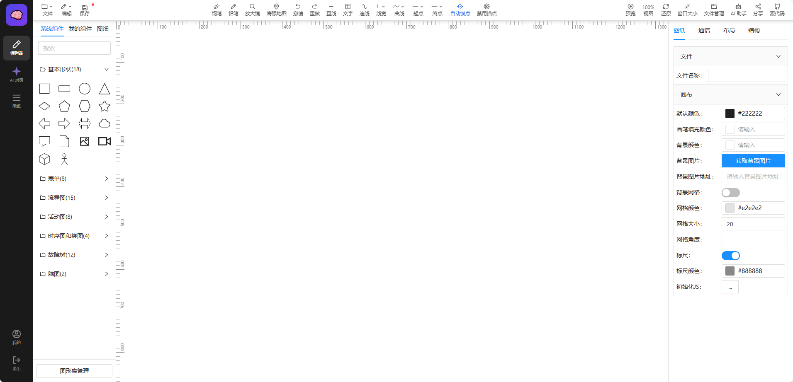

# Mind — AI 智能工作台

> ⚠️ **声明**：本项目谨用于学习用途，不提供任何担保，请勿用于生产环境。

集成 AI Agent 系统的智能工作台，支持自然语言对话完成**画布绘图、蓝图管理、思维导图、文件分析、数据可视化、地图路线规划、互联网搜索、图片搜索、翻译**等任务。基于 [Meta2D](https://github.com/le5le-com/meta2d.js) 渲染 2D 图形，支持流程图、架构图、UML 等 8 种图表类型。

**当前版本：** 0.0.2 | **在线预览：** [opendidi.github.io/mind](https://opendidi.github.io/mind)

[](https://github.com/opendidi/mind/blob/main/LICENSE)
[](https://github.com/opendidi/mind)
[](https://python.org)
[](https://vuejs.org)
[](https://typescriptlang.org)
[](https://flask.palletsprojects.com)
[](https://docs.docker.com/compose/)
[](https://mysql.com)
[](https://redis.io)

---



---

## 目录

- [功能特性](#功能特性)
  - [图形编辑](#图形编辑)
  - [AI 对话 & 知识助手](#ai-对话--知识助手)
  - [画布操控](#画布操控)
  - [聊天体验](#聊天体验)
- [技术栈](#技术栈)
- [项目结构](#项目结构)
- [快速开始](#快速开始)
- [API 接口](#api-接口)
- [Agent 架构](#agent-架构)
- [前端架构](#前端架构)
- [Docker 部署](#docker-部署)
- [开发指南](#开发指南)
- [贡献指南](#贡献指南)
- [相关资源](#相关资源)
- [License](#license)

---

## 功能特性

### 图形编辑

- 🎨 **丰富图元** — 矩形、圆形、三角形、菱形、五边形、星形、文本、图片等基础图形
- 🔗 **智能连线** — 直线、曲线、折线、思维导图曲线，支持多方向箭头
- 📐 **自动布局** — 水平/垂直/网格排列，左/右/居中/上/下对齐
- ↩️ **撤销重做** — 完整的操作历史回退，使用 structuredClone 高性能序列化
- 🔍 **鹰眼地图** — 全局缩略图导航
- 🔒 **三种模式** — 编辑 / 预览 / 锁定
- 📏 **标尺与网格** — 辅助精确定位
- ⌨️ **键盘快捷键** — Delete 删除、Ctrl+C/V/A/D 复制粘贴全选复制、方向键微调、Escape 取消选中
- 🎬 **动画与帧** — 帧编辑器 + 动画时间线，支持序列帧动画、过渡动效
- 📊 **数据绑定** — 图形属性与外部数据源绑定（HTTP/WebSocket/MQTT），支持实时变量替换
- 🎥 **视频笔触** — 视频播放器覆层，支持画布内视频嵌入
- 🖼️ **事件系统** — 图形级事件/动作绑定（click、dblclick、hover 等触发器 + 执行动作）
- 🎯 **样式面板** — 统一属性编辑（填充/边框/阴影/渐变/文字/透明度） + 100ms 渲染防抖
- 🎨 **颜色选择器** — TDesign ColorPicker，支持 CSS 格式 + 单色模式

#### 图表类型

| 类型 | 说明 |
|------|------|
| 流程图 | 步骤→判断→分支，带箭头连线 |
| 架构图 | 组件/服务拓扑，依赖关系 |
| 思维导图 | 中心主题→分支→细节，radial 布局 |
| 类图 | UML 类结构 |
| 时序图 | 时间线交互 |
| 活动图 | 业务流程 |
| FTA 图 | 故障树分析 |
| 表单图 | UI 表单布局 |

#### 文件管理

- 📁 **树形目录** — 文件夹管理，拖拽移动
- 📤 **上传下载** — 支持图片、SVG、文档
- 👁️ **在线预览** — 图片和 SVG 即时预览
- 📋 **素材库** — 可复用的图形模板

#### 蓝图系统

- 💾 **保存加载** — 完整画布状态持久化到后端
- 📤 **多格式导出** — PNG（位图）/ SVG（矢量）/ JSON（数据）
- 🔍 **搜索** — 按名称和分类检索

### AI 对话 & 知识助手

| 能力 | 说明 | 示例 |
|------|------|------|
| 🌐 **联网搜索** | 多引擎实时搜索（Bing/DDG/Exa/SearXNG/百度），支持 web / news / image 三种类型，自动回退+缓存兜底 | "Python 3.13 新特性""今天有什么新闻" |
| 🖼️ **图片搜索** | 搜索网络图片，结果以九宫格画廊展示，点击灯箱预览大图，支持查看来源 | "流浪地球剧照""星空壁纸""熊猫头表情包" |
| 🔍 **深度搜索** | deep 模式自动抓取前 3 条结果全文，支持代码/学术/百科领域自动路由优化 | "React 19 新 API 怎么用" |
| 🌍 **地图 & 路线** | 地理编码 + 交互式地图 + 驾车/步行/骑行/公交路线规划 | "北京故宫在哪""西站到故宫怎么走" |
| 📊 **数据可视化** | 上传 Excel 自动识别数据并生成 ECharts 图表（柱状/折线/饼图/散点） | "帮我分析这份销售数据" |
| 📄 **文档分析** | 上传 Word/Excel/JSON/TXT 文件，分页解析、关键词检索、路径导航提取 | "这份合同里有哪些关键条款" |
| 👁️ **图片理解** | 上传图片自动 OCR 文字提取 + 场景描述/物体检测/智能分类 | "识别这张截图里的报错信息" |
| 🌐 **在线翻译** | 40+ 语言互译，自动检测源语言，支持通用/正式/技术三种风格 | 右键选中消息 → 翻译 |
| 🧠 **思维导图** | 纯文本生成交互式 markmap 思维导图（支持缩放/平移/全屏） | "做一个机器学习知识体系的思维导图" |

### 画布操控

- 🤖 **自然语言画图** — "画一个登录流程图" → AI 自动创建节点和连线
- 🧠 **智能图表生成** — 支持流程图、架构图、UML 类图、时序图、活动图等
- 📐 **智能排版** — 网格/树形/力导向/分层 4 种布局算法
- ⏱️ **快照回滚** — Agent 每次写操作自动保存快照，对话中随时回退到历史版本
- 📋 **蓝图管理** — 搜索、加载、保存、导出（PNG/SVG/JSON），对比两个蓝图差异、合并蓝图
- 📦 **操作宏** — 将常用操作序列保存为可复用宏
- 🏗️ **蓝图模板** — 从预置模板（三层架构/微服务/数据管道/类图/SWOT）一键创建

### 聊天体验

- 💬 **双入口** — 全屏聊天页（`/chat`）+ 编辑器侧边栏 AgentPanel
- 🔧 **过程透明** — 实时展示思考过程、工具调用、执行计划
- 🔊 **语音朗读** — Web Speech API（即时）+ ChatTTS（高质量）双引擎
- 💬 **消息引用** — 回复时引用历史消息
- ✏️ **消息编辑** — 已发送消息支持二次编辑
- 📌 **会话管理** — 置顶、搜索、导出（JSON/Markdown）
- 📎 **文件上传** — 聊天中上传图片/文档作为上下文

---

## 技术栈

### 后端

| 类别 | 技术 | 说明 |
|------|------|------|
| **语言 / 框架** | Python 3.10+ / Flask 3.0 + eventlet | REST API + SSE 流式响应 |
| **Agent 系统** | 自研六层架构 | Guard → Intent → Planner → Executor → Supervisor → Memory |
| **LLM** | DeepSeek API（主）+ 多级 Fallback | 支持 OpenAI 兼容 API 作为备选 |
| **数据库** | MySQL 8.0 | PyMySQL + DBUtils 连接池 |
| **缓存** | Redis 7 | 会话、搜索缓存、Agent 记忆、LLM 确定性缓存 |
| **对象存储** | MinIO | 文件/素材/蓝图存储 |
| **搜索引擎** | Bing / DDGS / Baidu / Exa / SearXNG | 5 引擎多策略链 |
| **翻译引擎** | Argos Translate（本地）+ LLM Fallback | 40+ 语言，TTL 缓存 |
| **TTS** | ChatTTS | 高质量中文语音合成 |

### 前端

| 类别 | 技术 | 说明 |
|------|------|------|
| **框架** | Vue 3 + TypeScript + Vite 4 | Composition API |
| **UI 库** | Ant Design Vue 3.2 + TDesign Vue Next | 企业级组件 |
| **图形引擎** | @meta2d/core + 8 个 diagram 插件 | 画布渲染核心 |
| **图表** | ECharts 6 | 数据可视化 |
| **思维导图** | markmap | 交互式脑图渲染 |
| **代码编辑器** | Monaco Editor | 代码编辑容器 |
| **地图** | AMap（高德地图） | 地理编码 + 路线规划 |
| **状态管理** | Pinia 2 | Vue 3 官方推荐 |
| **CSS** | Windi CSS | 原子化 CSS |
| **包管理** | pnpm | monorepo 工作空间 |

### DevOps

| 类别 | 技术 |
|------|------|
| **容器化** | Docker + Docker Compose |
| **Python Lint/Format** | Ruff |
| **前端 Format** | Prettier |
| **TypeScript 检查** | vue-tsc |
| **Git Hooks** | pre-commit |
| **测试** | pytest + vitest |

---

## 项目结构

```
mind/
├── app/                              # Python 后端
│   ├── api/v1/                       # REST API (agent, auth, chat, blueprint, material, translate)
│   ├── config/                       # 环境变量 + 配置常量
│   ├── package/module/               # MySQL 数据访问层 (user, chat, blueprint, material, categories)
│   ├── plugin/                       # 插件 (JWT auth, MinIO 对象存储)
│   └── util/
│       ├── agent/                    # Agent 核心包 — Agent OS 架构 (30+ 模块)
│       │   ├── core.py               # AgentSession — 消息构建、视觉桥接、会话管理
│       │   ├── engine.py             # AgentEngine — 统一执行入口
│       │   ├── guard.py              # InputGuard / ToolGuard / OutputGuard 三级安全
│       │   ├── intent.py             # 意图分类 + 统一意图规划
│       │   ├── planner.py            # 任务规划器
│       │   ├── executor.py           # 工具执行器 + Critic 提示
│       │   ├── dag.py                # DAG 并行执行引擎 + 条件分支
│       │   ├── memory.py             # 4 层记忆体系 (工作/短期/长期/项目)
│       │   ├── state.py              # WorldState — 统一世界状态模型
│       │   ├── critic_agent.py       # CriticAgent — 独立四维质量审查
│       │   ├── tool_router.py        # 意图→工具集路由 (减少 40-60% prompt)
│       │   ├── model_router.py       # 任务→模型路由 (cheap/balanced/quality)
│       │   ├── canvas_shadow.py      # CanvasShadow — 画布影子状态追踪
│       │   ├── reflexion.py          # 战略反思 — retry/skip/escalate
│       │   ├── circuit.py            # Circuit Breaker — LLM 熔断保护
│       │   ├── fallback.py           # 多级 LLM 故障转移
│       │   ├── observability.py      # 结构化追踪 + Token 预算
│       │   ├── skills/               # 域 Skill 模块 (canvas, blueprint, mindmap, file, code, translate)
│       │   ├── tools/                # 工具函数 (canvas 子包, blueprint, macro, file, web, geo, code, translate)
│       │   ├── agents/               # 子 Agent (canvas, blueprint, file, code)
│       │   └── eval/                 # Agent 评估框架
│       ├── search/                   # 搜索引擎 (5 引擎多策略链 + 缓存 + 排序)
│       ├── translate/                # 翻译引擎 (Argos 本地 + LLM 回退 + TTL 缓存)
│       ├── vision.py                 # 视觉分析 (DeepSeek Vision)
│       └── llm_client.py             # LLM 通用客户端
│
├── web/                              # Vue 3 前端
│   ├── src/
│   │   ├── views/                    # 页面 (编辑器, 预览, 全屏聊天, 用户)
│   │   ├── components/
│   │   │   ├── Meta2D/               # 核心编辑器 (17 个子组件: 画布, 工具栏, 属性面板, 动画, 事件...)
│   │   │   ├── AgentPanel/           # AI 对话抽屉面板
│   │   │   ├── chat/                 # 全屏聊天组件 (消息/引用/翻译/思维导图/图表卡片...)
│   │   │   ├── FileManager/          # 文件/素材管理器
│   │   │   ├── blueprint/            # 蓝图弹窗
│   │   │   └── shared/               # 共享组件 (MapCard, RouteCard, ColorPicker)
│   │   ├── composables/              # Vue Composables (useAgentChat, useConversations, useSpeech...)
│   │   ├── api/                      # API 客户端 (agent, chat, user, blueprint, material, translate)
│   │   ├── store/modules/            # Pinia 状态管理 (user)
│   │   ├── router/                   # Hash 路由 + 权限守卫
│   │   └── utils/                    # 工具函数 (canvasBridge, layoutEngine, request...)
│   └── vite.config.ts                # Vite 构建配置
│
├── tests/                            # Python 测试 (11 个文件, pytest + vitest)
├── scripts/                          # 质量门禁脚本
├── sql/                              # 数据库初始化
├── docs/                             # GitHub Pages 部署
├── app/data/blueprint_templates/     # 预置蓝图模板 (5 个)
├── starter.py                        # 后端启动入口
├── Dockerfile                        # Python 3.12-slim 镜像
├── docker-compose.yml                # 三服务编排 (app + mysql + redis)
├── requirements.txt                  # Python 依赖
├── pyproject.toml                    # Ruff + Pytest 配置
├── .env.example                      # 环境配置模板
└── CLAUDE.md                         # 项目开发指南
```

---

## 快速开始

### 环境要求

| 依赖 | 版本 | 说明 |
|------|------|------|
| Python | ≥ 3.10 | 后端运行 |
| Node.js | ≥ 16 | 前端构建 |
| pnpm | 最新版 | 前端包管理（必须使用 pnpm） |
| MySQL | 8.0 | 数据持久化 |
| Redis | 7 | Agent 缓存/记忆（不可用时自动降级为内存模式） |

### 1. 克隆项目

```bash
git clone https://github.com/opendidi/mind.git
cd mind
```

### 2. 配置环境变量

```bash
cp .env.example .env
```

编辑 `.env` 文件，填入实际配置：

```env
# 数据库（必填）
DB_HOST=localhost
DB_USER=root
DB_PASSWORD=your_password
DB_PORT=3306
DB_NAME=mind

# Redis（Agent 系统需要，不可用时自动降级为内存模式）
REDIS_HOST=127.0.0.1
REDIS_PORT=6379
REDIS_PASSWORD=

# LLM API Key（使用 AI 助手功能必须配置）
DEEPSEEK_API_KEY=sk-your-deepseek-api-key
DEEPSEEK_BASE_URL=https://api.deepseek.com

# 可选：Fallback LLM（主 LLM 故障时自动切换）
# FALLBACK1_API_KEY=sk-your-openai-key
# FALLBACK1_BASE_URL=https://api.openai.com/v1
# FALLBACK1_MODEL=gpt-4o-mini

# 可选：MinIO 对象存储
# MINIO_ENDPOINT=localhost:9000
# MINIO_ACCESS_KEY=minioadmin
# MINIO_SECRET_KEY=minioadmin
# MINIO_BUCKET_NAME=mind
```

### 3. 初始化数据库

确保 MySQL 已运行，创建 `mind` 数据库：

```sql
CREATE DATABASE IF NOT EXISTS mind DEFAULT CHARSET utf8mb4;
```

项目启动时会自动建表。

### 4. 安装依赖

**Python 后端：**

```bash
pip install -r requirements.txt
```

**前端：**

```bash
pnpm install
```

### 5. 启动服务

**启动后端（端口 5001）：**

```bash
python starter.py
```

**启动前端开发服务器（端口 3100）：**

```bash
pnpm dev:web
```

打开浏览器访问 `http://localhost:3100` 即可使用。

> 前端开发环境通过 Vite proxy 将 API 请求转发到 `http://127.0.0.1:5001/v1/`。

### 6. 使用 AI 助手

1. 确保 `.env` 中配置了 `DEEPSEEK_API_KEY`
2. **编辑器侧边栏**：点击顶部工具栏的 🤖 **AI 助手** 按钮
3. **全屏对话**：访问 `/chat` 路由，在独立页面中对话
4. 输入需求，例如：
   - "帮我画一个用户登录流程图"
   - "把这些图形垂直排列，间距 50px"
   - "搜索名字包含'架构'的蓝图"
   - "生成一个微服务架构的思维导图"

---

## API 接口

### 认证

| 方法 | 路径 | 说明 |
|------|------|------|
| `POST` | `/v1/auth/captcha` | 获取图形验证码 |
| `POST` | `/v1/auth/login` | 用户登录 |
| `POST` | `/v1/auth/logout` | 退出登录 |
| `POST` | `/v1/auth/register` | 用户注册 |
| `POST` | `/v1/auth/refresh` | 刷新 Token |
| `GET` | `/v1/auth/profile` | 获取个人信息 |
| `POST` | `/v1/auth/change-password` | 修改密码 |

### 会话管理

| 方法 | 路径 | 说明 |
|------|------|------|
| `GET` | `/v1/chat/conversations` | 会话列表（分页） |
| `POST` | `/v1/chat/conversations` | 创建/更新会话 |
| `DELETE` | `/v1/chat/conversations/<id>` | 删除会话 |
| `POST` | `/v1/chat/feedback` | 消息反馈 |
| `POST` | `/v1/chat/upload` | 文件上传 |

### AI Agent

| 方法 | 路径 | 说明 |
|------|------|------|
| `POST` | `/v1/agent/chat` | SSE 流式对话 |
| `POST` | `/v1/agent/mcp` | MCP JSON-RPC 工具调用 |
| `POST` | `/v1/agent/tts` | 文本转语音 |
| `GET` | `/v1/agent/health` | 健康检查 + 指标快照 |

**Agent Chat 请求格式：**

```json
{
  "message": "帮我画一个登录流程图",
  "user_id": "user_001",
  "canvas_context": {
    "pens": [{"id": "p1", "type": "rectangle", "x": 100, "y": 50, "text": "开始"}],
    "lines": [],
    "selectedIds": [],
    "viewportCenter": {"x": 400, "y": 300}
  },
  "canvas_snapshot": [
    {"id": "p1", "type": "rectangle", "text": "开始", "x": 100, "y": 50, "width": 100, "height": 60}
  ],
  "images": ["data:image/png;base64,..."]
}
```

**SSE 事件类型：**

| 事件 | 说明 |
|------|------|
| `token` | 逐字输出 |
| `thinking` | 思考过程 |
| `tool_call` | 工具调用开始（含参数） |
| `tool_result` | 工具调用结果（含成功/失败） |
| `plan` | DAG 执行计划 |
| `step_start/end/fail` | 计划步骤状态变更 |
| `progress` | 执行进度 |
| `message` | 完整回复文本 |
| `trace` | 调用链追踪 ID |
| `error` | 错误信息 |
| `done` | 对话完成 |

### 蓝图管理

| 方法 | 路径 | 说明 |
|------|------|------|
| `GET` | `/v1/blueprint/lists` | 分页列表 |
| `GET` | `/v1/blueprint/find?id=` | 按 ID 查询 |
| `POST` | `/v1/blueprint/add` | 创建蓝图 |
| `POST` | `/v1/blueprint/modify` | 修改蓝图 |
| `POST` | `/v1/blueprint/delete` | 删除蓝图 |

### 素材管理

| 方法 | 路径 | 说明 |
|------|------|------|
| `GET` | `/v1/material/lists` | 分页列表 |
| `GET` | `/v1/material/folder` | 文件夹树 |
| `GET` | `/v1/material/preview` | 预览文件 |
| `POST` | `/v1/material/upload` | 上传文件 |
| `POST` | `/v1/material/create_dir` | 创建文件夹 |
| `POST` | `/v1/material/delete` | 删除 |
| `POST` | `/v1/material/modify` | 重命名 |
| `POST` | `/v1/material/copy` | 复制 |
| `POST` | `/v1/material/scissors` | 移动 |

### 翻译

| 方法 | 路径 | 说明 |
|------|------|------|
| `POST` | `/v1/translate/translate` | 翻译文本（可选 source_lang/target_lang/style） |
| `GET` | `/v1/translate/languages` | 获取支持的语言列表 + 引擎状态 |

**翻译引擎架构：**

```
请求 → TranslationEngine.translate()
        ├── 命中缓存（TTL 30min, 最多 256 条） → 返回 :cached
        ├── Argos Translate（本地引擎，已安装的语言对） → 快速免费
        └── LLM Fallback（DeepSeek，未安装或特殊风格） → 全覆盖 + 三种风格
```

| 特性 | 说明 |
|------|------|
| **语言检测** | CJK 字符集比例启发式（>30% 阈值），与前端统一 |
| **风格** | `general`（通用）、`formal`（正式）、`technical`（技术文档） |
| **缓存** | MD5 哈希键，TTL 30 分钟，最多 256 条，满时淘汰最旧条目 |
| **引擎** | Argos Translate（免费本地）为主，LLM 回退（DeepSeek） |

**翻译入口（三处统一管道）：**

| 入口 | 方式 | 场景 |
|------|------|------|
| API 端点 | `POST /v1/translate/translate` | HTTP 直接调用 |
| Agent 工具 | `translate_text` 工具 | Agent 对话中翻译 |
| 消息内联 | TranslatePopover 组件 | 右键消息 → 翻译 |

### 搜索引擎

| 引擎 | 类型 | 说明 |
|------|------|------|
| Bing | 主引擎 | Microsoft Bing Web Search API |
| DDGS | 回退 | DuckDuckGo 匿名搜索（免费，无 API Key） |
| Baidu | 中文 | 中文搜索优先 |
| Exa | 语义 | Exa AI 语义搜索（可选配置） |
| SearXNG | 聚合 | 自托管元搜索引擎（可选配置） |

**多策略链：**

```
web_search(query)
  ├── Race 竞速（auto 模式）  → 所有引擎并行，先到先得，全局 8s 超时
  ├── 顺序回退（指定引擎）     → 主引擎失败自动切换下一个
  ├── 跨引擎去重               → 短时间窗内合并、去重、BM25 排序
  ├── 关键词降级               → 长查询全失败时拆成短词重试
  ├── 过期缓存兜底             → 引擎全挂时返回 30 分钟内旧缓存（stale 标记）
  ├── 领域路由               → 代码 → GitHub/SO，学术 → Scholar，百科 → Wikipedia
  └── 深度搜索               → basic 返回摘要，deep 自动抓取全文
```

| 特性 | 说明 |
|------|------|
| **缓存** | Redis TTL 5 分钟，引擎全挂时过期缓存兜底 |
| **监控** | 成功率滑动窗口 + 引擎降级 + 自动告警 |
| **排序** | BM25 算法 + 去重 + 统一格式化 |

---

## Agent 架构

Agent 系统已演进到 **Agent OS 级别**，具备统一状态管理、项目认知、独立审查、战略反思、多 Agent 协作等完整能力。

### 架构等级：Level 5 — Agent Operating System

```
Level 1  Basic Chatbot      LLM + 对话记忆
Level 2  ReAct Agent         LLM + 工具调用循环
Level 3  Multi-Agent         多 Agent + 任务委派
Level 4  Agent Runtime       DAG + 规划 + 反思 + 长期记忆
Level 5  Agent OS  ← 当前    状态管理 + 项目认知 + 独立审查 + 战略反思 + 多 Agent 协作
```

### 执行流程

```
用户输入 → InputGuard
                ↓
        StateManager.load()     ← 加载 WorldState + CanvasShadow
        CanvasShadow.sync()     ← 前端快照 → 影子状态 diff 同步
                ↓
        ToolRouter.route()      ← 按领域过滤工具集（减少 prompt 40-60%）
        ModelRouter.route()     ← 按任务复杂度选模型（cheap/balanced/quality）
                ↓
        SnapshotManager.save("pre_execution")
                ↓
        Intent 分类（LLM Cache 状态感知失效 → canvas/blueprint 版本变化自动刷新）
                ↓
        Domain Skill 注入 → Plan 生成（统一 LLM 调用 + WorldState + CanvasShadow）
                ↓
        AgentEngine 路由
        ├── simple 模式 → BaseExecutor（单轮 ReAct 循环）
        └── dag 模式    → DAGExecutor（拓扑排序 + 并行 + 条件分支 + CanvasShadow 线程安全写入）
                ↓
        Tool 执行（canvas_edit / canvas_organize / canvas_view + ToolGuard + Circuit Breaker）
                ↓
        CanvasShadow 同步写 ← add_pen/add_line/delete_pen → shadow add/remove/validate
                ↓
        Reflexion 自纠正 → Pheromone 信息素沉积（Redis 持久化）
                ↓
        CriticAgent.review()  ← 独立质量审查（正确性/完整性/一致性/安全性）
                ↓
        StateManager.save() + CanvasShadow.save()  ← Redis 持久化（30min TTL）
        SnapshotManager.save("post_execution")
                ↓
        OutputGuard → SSE 流式输出 → 会话记忆 + PlanMemory 用户隔离存储
```

### 工具集（25 个）

| 域 | 工具 | 说明 |
|----|------|------|
| **Canvas** | `canvas_edit` | 图形编辑（11 action: add_pen/add_line/add_diagram/update_pen/delete_pen/duplicate/move_pen/undo/redo/clear/get_state） |
| | `canvas_organize` | 图形组织（7 action: group/ungroup/lock/unlock/toggle_visibility/auto_arrange/align） |
| | `canvas_view` | 视图与属性（6 action: set_props/fit_view/check_empty/list_snapshots/restore_snapshot/save_snapshot） |
| **Blueprint** | `blueprint_*` | 列表/加载/保存/搜索/导出/diff/merge/从模板创建 |
| **Macro** | `macro` | 操作宏管理（list/run/save），Redis 持久化 |
| **Web** | `web_search` / `web_fetch` | 5 引擎搜索 + 网页内容抓取 |
| **Geo** | `geo_geocode` / `geo_route` | 地理编码 + 路线规划 |
| **翻译** | `translate_text` | Argos 本地 + LLM 回退，三种风格 |
| **文件** | `file_*` | 素材文件 CRUD |
| **代码** | `code_generate` | JavaScript/JSON 代码生成 |

### 子 Agent

| Agent | 工具域 | 职责 |
|-------|--------|------|
| `canvas_agent` | canvas_edit + canvas_organize + canvas_view + blueprint_save | 画布图形创建、编辑、布局、视图、快照、保存 |
| `blueprint_agent` | blueprint_* + diff + merge + from_template | 蓝图搜索、加载、保存、导出、对比、合并、模板创建 |
| `file_agent` | file_search | 文件/素材检索管理 |
| `code_agent` | code_generate | JavaScript/JSON 代码生成 |

### 高级特性

| 特性 | 说明 |
|------|------|
| **Canvas Tool Unification** | 画布工具从 6 个重构为 3 个语义工具（edit/organize/view），减少 LLM 混淆 |
| **CanvasShadow 状态追踪** | 后端维护轻量画布影子状态，跨轮次 pen ID 校验 + 线程安全锁 |
| **Canvas Context 语义截断** | 4 层预算分配（选中→邻居→有文字→其余），确保关键上下文不被截断 |
| **Layout Engine** | 4 种布局算法：网格(grid) / 树形(tree) / 力导向(force) / 分层(layered) |
| **Canvas Snapshot 回滚** | 每次写操作自动快照，对话中随时回滚到历史版本 |
| **Macro 操作宏** | 将操作序列保存为可复用宏，Redis 持久化 |
| **Cross-Blueprint** | 蓝图对比(diff)、合并(merge add/replace/preview)、从模板创建(from_template) |
| **WorldState 状态管理** | 统一 Agent 世界状态模型，JSON 序列化，乐观锁版本控制 |
| **StateStore + 快照** | Redis 持久化状态 + 版本快照/回滚/diff，支持时间旅行调试 |
| **StateReducer** | 并行 DAG 节点的确定性状态合并 + 冲突检测 |
| **Project Memory** | 跨会话项目级记忆（用户偏好/技术栈约束/历史决策） |
| **Critic Agent** | 独立质量审查 Agent，正确性/完整性/一致性/安全性四维评估 |
| **ToolRouter** | 意图→工具集路由，prompt 中 tool schema 数量减少 40-60% |
| **ModelRouter** | 任务类型→模型路由，cheap/balanced/quality 三档成本优化 |
| **Strategic Reflexion** | 战略级反思 — 发现计划不合理时直接重规划 |
| **StateDAGNode** | 条件分支 DAG 节点，支持前置条件/后置条件/条件边 |
| **Multi-Agent Negotiation** | 多 Agent propose→critique→consensus 协商机制 |
| **统一意图规划** | 单次 LLM 调用同时完成意图分类 + 领域检测 + DAG 计划生成 |
| **DAG 并行执行** | 无依赖步骤同时执行，拓扑排序调度，信息素跨节点传递 |
| **AgentReflexion** | 工具失败自动分析原因，retry/skip/escalate + strategy 四级纠正 |
| **Plan-Feedback 闭环** | 执行后评分 → 历史教训存储（用户隔离） → 下次规划时自动注入提示 |
| **Circuit Breaker** | LLM 连续失败自动熔断，冷却后半开探测 |
| **多级 Fallback** | 主 LLM 故障时透明切换到备用模型（最多 3 级） |
| **LLM 确定性缓存** | Redis 缓存 `compact_history` 和 `unified_intent` 结果（状态感知失效） |
| **Context Compaction** | LLM 驱动对话历史压缩，超长上下文自动摘要 |
| **Streaming SSE** | 逐 Token + 工具调用实时流式输出，含完整执行计划追踪 |
| **Tracing + Token 预算** | Span 树调用链追踪 + 实时 Token 消耗监控 |
| **Redis 降级** | Redis 不可用时自动切换为内存模式，不影响核心功能 |
| **三级安全护栏** | InputGuard（注入检测）+ ToolGuard（调用频率限制）+ OutputGuard（响应清洗） |

### 记忆体系

```
Memory
├── Working Memory   (进程内存)        当前会话上下文，LLM 驱动的上下文压缩
├── Short-Term       (Redis, TTL 1h)   最近会话摘要 + 话题标签
├── Long-Term        (Redis, TTL 30d)  历史会话索引，关键词匹配检索
└── Project          (Redis, TTL 30d)  跨会话项目知识（偏好/规范/约束/决策）
```

### 与业界框架对比

| 能力 | MIND (v2.1) | LangGraph | CrewAI | AutoGen |
|------|:----------:|:---------:|:------:|:-------:|
| DAG 并行执行 | ✅ | ✅ | ❌ | ❌ |
| 统一状态管理 | ✅ | ✅ | ❌ | ❌ |
| 画布影子状态追踪 | ✅ | ❌ | ❌ | ❌ |
| 独立 Critic Agent | ✅ | ❌ | ❌ | ❌ |
| 工具路由 + 语义化 | ✅ | ❌ | ❌ | ❌ |
| 模型路由 | ✅ | ❌ | ❌ | ❌ |
| 项目级记忆 | ✅ | ❌ | ❌ | ❌ |
| 战略反思 | ✅ | ❌ | ❌ | ❌ |
| 多 Agent 协商 | ✅ | ❌ | ✅ | ✅ |
| 状态快照/回滚 | ✅ | ✅ | ❌ | ❌ |
| 操作宏/模板 | ✅ | ❌ | ❌ | ❌ |
| 蓝图 diff/merge | ✅ | ❌ | ❌ | ❌ |
| 熔断 + Fallback | ✅ | ❌ | ❌ | ❌ |
| MCP 协议 | ✅ | ❌ | ❌ | ❌ |

---

## 前端架构

### Composables 数据流

```
useAuthCaptcha → useConversations → useAgentChat → useScrollToBottom
                      ↓                    ↓
                 会话 CRUD          SSE 流式对话
                 silentSave         onStreamTick
                 saveCurrentConv    onDone
                      ↓                    ↓
               useKeyboardShortcuts    useSpeech (TTS)
               useCanvas (provide/inject 画布实例)
```

### 关键设计

- **CanvasManager** — 通过 `provide/inject` 模式管理 Meta2D 实例，支持多画布场景扩展
- **canvasBridge** — 聊天与画布双向通信桥：Agent 工具调用结果 → `notifyCanvasMutation()` → Meta2D API 操作 → localStorage 同步 + dirty 标记 + 自定义事件派发
- **流式保存** — `onStreamTick` 做增量保存，`onDone` 做最终提交，避免会话丢失
- **双引擎 TTS** — Web Speech API 即时语音（浏览器内置，零延迟）+ ChatTTS 高质量合成（后端 API），全局单例播放，新播放自动停止旧播放
- **翻译管道** — 三入口统一：API 端点 / Agent 工具 / 消息内联弹窗，共享 TranslationEngine + TTL 缓存
- **代码块复制** — 消息中的代码块自动渲染为暗色主题代码卡片，支持一键复制
- **Token 自动刷新** — Axios 拦截器处理 401 → 并发请求排队等待刷新 → 自动重放

---

## Docker 部署

### 环境要求

| 依赖 | 用途 | 必需 |
|------|------|------|
| Docker Desktop | 运行后端容器 | ✅ |
| MySQL 8.0 | 数据库（已有的即可） | ✅ |
| Redis 7 | 缓存 / Agent 系统 | ✅ |
| MinIO | 文件 / 对象存储 | 可选 |

### 1. 配置 .env（Docker 专用）

```bash
cp .env.example .env
```

编辑 `.env`，**关键：host 必须用 `host.docker.internal`**（容器内访问宿主机）：

```env
# MySQL / Redis — 指向宿主机
DB_HOST=host.docker.internal
DB_PORT=3306
DB_USER=root
DB_PASSWORD=你的MySQL密码
DB_NAME=mind

REDIS_HOST=host.docker.internal
REDIS_PORT=6379

# MinIO（如已运行）
MINIO_ENDPOINT=host.docker.internal:9000
MINIO_CDN_URL=host.docker.internal:9000
MINIO_BUCKET_NAME=mind
MINIO_ACCESS_KEY=你的MinIO账号
MINIO_SECRET_KEY=你的MinIO密码
MINIO_SECURE=false

# LLM（Agent 必填）
DEEPSEEK_API_KEY=sk-你的key
DEEPSEEK_BASE_URL=https://api.deepseek.com

# 安全
SECRET_KEY=随便一串随机字符
```

### 2. Docker Desktop 镜像加速（国内必配）

Docker Desktop → Settings → Docker Engine，添加 mirror：

```json
{
  "registry-mirrors": [
    "https://docker.m.daocloud.io",
    "https://hub-mirror.c.163.com"
  ]
}
```

点击 **Apply & Restart**。

### 3. 构建并启动

```powershell
# 首次构建（含 PyTorch，约 3~5 分钟）
docker compose up -d --build
```

> **日常开发**：改 Python 代码只需 `docker compose restart app`（2 秒生效），不需要 rebuild。
> 代码通过 volume 挂载（`./app:/app/app`），修改实时同步。
> 只有改 `Dockerfile` 或 `requirements.txt` 时才需要 `docker compose up -d --build`。

### 4. 前端开发（另开终端）

```powershell
pnpm install
pnpm dev:web
```

前端运行在 `http://localhost:3100`，API 代理到 `http://localhost:5001`。

<details>
<summary><b>📋 Docker 常用命令参考</b></summary>

```powershell
# ── 容器管理 ────────────────────────────────────────
docker compose ps                     # 查看容器状态
docker compose down                   # 停止并删除容器
docker compose restart app            # 修改 Python 代码后重启（2 秒，推荐）
docker compose down -v                # 停止并清空数据卷（慎用）

# ── 启动 & 重建 ─────────────────────────────────────
docker compose up -d --build          # 改 Dockerfile/requirements.txt 后才需要（约 3-5 分钟）
docker compose up -d                  # 首次启动或改 .env 后重启
docker compose build --no-cache       # 强制无缓存重建

# ── 查看日志 ────────────────────────────────────────
docker compose logs -f --tail=50      # 实时查看全部服务日志
docker logs -f mind-app               # 只跟踪 app 日志（Ctrl+C 退出）
docker logs --tail=200 mind-app       # 最近 200 行
docker logs --tail=500 mind-app 2>&1  # 最近 500 行（含 stderr）
docker logs --since 5m mind-app       # 最近 5 分钟的日志

# ── Python 报错排查 ─────────────────────────────────
docker logs -f mind-app               # 实时跟踪，报错会直接出现在终端
docker logs mind-app --tail=300 2>&1  # 容器反复重启时，查看上一次崩溃日志

# ── 手动启动（容器崩溃时排查）────────────────────────
docker run --rm -it --env-file .env mind-app bash   # 用 bash 替代默认 CMD
# 进入后手动运行，直接在终端看完整回溯：
python starter.py

# ── 进入容器调试 ────────────────────────────────────
docker exec -it mind-app bash         # 进入容器 shell
docker exec mind-app env              # 查看环境变量
docker exec mind-app python -c "..."  # 在容器内执行一段 Python

# ── 镜像管理 ────────────────────────────────────────
docker images mind-app                # 查看镜像大小
docker builder prune                  # 清理构建缓存
docker system prune -a                # 清理所有无用镜像/容器
```

</details>

### Docker 常见问题

| 问题 | 原因 | 解决 |
|------|------|------|
| Python 报错 | 容器内代码异常 | `docker logs -f mind-app` 实时查看回溯 |
| 容器反复重启 | 应用启动崩溃 | `docker logs --tail=300 mind-app` 查看上一次错误 |
| MySQL 连接拒绝 (2003) | `.env` 中 `DB_HOST` 不正确 | Docker 内用 `mysql`（compose 服务名）或 `host.docker.internal` |
| 验证码文字太小 | 容器无 TrueType 字体 | Dockerfile 已装 `fonts-dejavu-core`，代码优先加载 |
| pip install 超时 | PyPI 网络不通 | Dockerfile 已配阿里云镜像源 |
| apt-get update 失败 | Debian 源不通 | Dockerfile 已配阿里云镜像源 |
| 基础镜像拉取失败 | Docker Hub 被墙 | 配 Docker Desktop registry-mirror |
| 环境变量未生效 | 只 restart 没重建容器 | 执行 `docker compose down && docker compose up -d` |

---

## 开发指南

### 代码规范

项目已配置 pre-commit hooks，首次使用请安装：

```bash
pip install pre-commit && pre-commit install
```

| 工具 | 用途 | 命令 |
|------|------|------|
| Ruff | Python Lint & Format | `python -m ruff check app/ && python -m ruff format app/` |
| Prettier | 前端格式化 | `cd web && pnpm format` |
| Vue TSC | TypeScript 类型检查 | `cd web && npx vue-tsc --noEmit` |

### 测试

```bash
# 后端 pytest（11 个测试文件，支持 unit/slow 标记）
pytest tests/ -v --tb=short --timeout=30

# 仅单元测试（跳过需要外部服务的测试）
pytest tests/ -v -m "not slow"

# 前端 vitest
cd web && npx vitest run

# 全量质量门禁（Ruff → Pytest → vue-tsc → Vite Build）
bash scripts/run_checks.sh
```

### Commit 规范

遵循 [Conventional Commits](https://www.conventionalcommits.org/)：

| 前缀 | 用途 | 示例 |
|------|------|------|
| `feat:` | 新功能 | `feat: add canvas snapshot rollback` |
| `fix:` | Bug 修复 | `fix: resolve SSE connection leak` |
| `refactor:` | 重构 | `refactor: unify canvas tools into 3 semantic tools` |
| `perf:` | 性能优化 | `perf: add LLM deterministic cache` |
| `docs:` | 文档 | `docs: update API reference` |
| `chore:` | 杂项 | `chore: update dependencies` |

### Agent 开发约定

```python
# ✅ 推荐：新导入路径
from app.util.agent.core import AgentSession
from app.util.agent.guard import InputGuard

# ⚠️ 已弃用：旧路径（仍可用但会触发 DeprecationWarning）
from app.util.agent_core import AgentSession
```

- 使用 `logging` 模块，不要用 `print()`
- 业务异常用 `logging.warning()`，系统错误用 `logging.error()`
- 错误消息：用户可读 → 中文，内部日志 → 英文
- 所有 `except:` 必须记录日志，禁止裸 except

详见 [`CLAUDE.md`](CLAUDE.md)。

---

## 贡献指南

欢迎贡献代码、报告问题或提出建议！

### 贡献流程

1. **Fork** 本仓库
2. 创建特性分支：`git checkout -b feat/your-feature`
3. 编写代码并确保通过质量门禁：`bash scripts/run_checks.sh`
4. 遵循 [Conventional Commits](#commit-规范) 提交代码
5. 推送到远程分支并发起 **Pull Request** 到 `main` 分支

### 问题反馈

- 使用 [GitHub Issues](https://github.com/opendidi/mind/issues) 报告 Bug 或提出功能建议
- 请提供详细的操作步骤、预期行为和实际行为
- 附带相关的日志或截图（如有）

---

## 相关资源

- [meta2d.js 开源仓库](https://github.com/le5le-com/meta2d.js)
- [meta2d.js 文档](https://doc.le5le.com/document/119359590)
- [项目在线预览](https://opendidi.github.io/mind)

## License

[Apache License 2.0](LICENSE)
